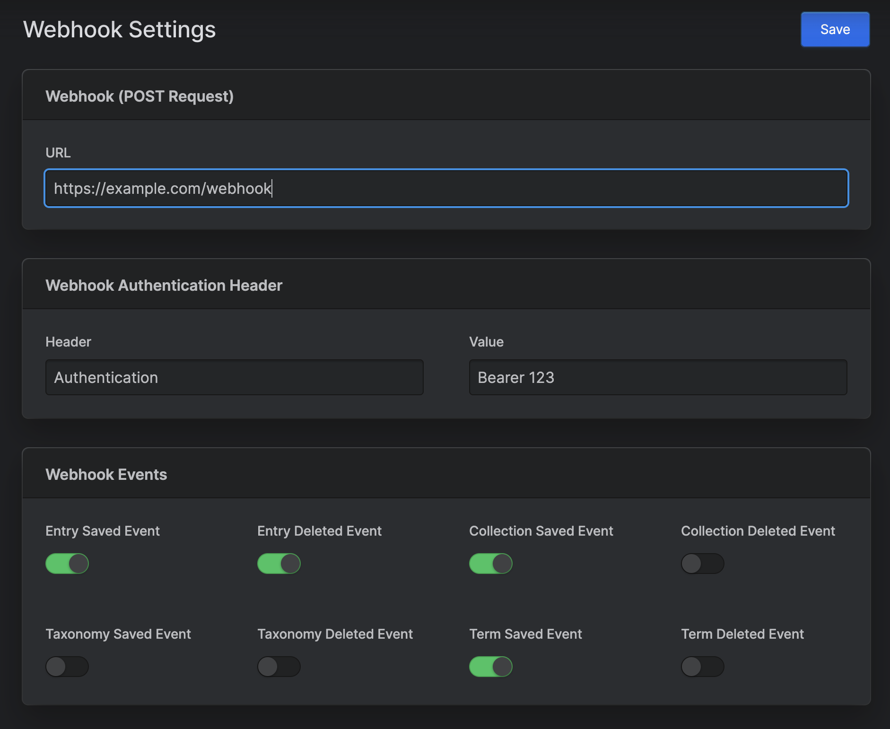

# Statamic Webhook

> Statamic Webhook is a Statamic addon that sends statamic events to a webhook URL of your choice.

## Features



This addon allows you to::

- Specify a webhook URL 
- Enable / Disable Certain Events

## How to Install

Require the package using composer.

``` bash
composer require bagwaa/webhook
```

Publish the configuration file using the following command in the root of your project, this is needed to configure the addon.

``` bash
php artisan vendor:publish --tag=bagwaa\webhook
```

## How to Use

Within the control panel you can find the settings for the addon under the `Webhook` section. Here you can specify the URL you want to send the events to and enable / disable certain events to cut out some of the noise
